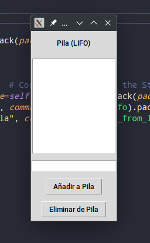

# Demostración de Estructuras de Datos: LIFO y FIFO

Este proyecto es una herramienta interactiva que demuestra los conceptos de LIFO (Last In, First Out) y FIFO (First In, First Out) utilizando pilas y colas. La interfaz gráfica permite al usuario interactuar con ambas estructuras de datos, añadiendo y eliminando elementos para observar su comportamiento.

## Estructura de Archivos

- `lifo_demo.py`: Demostración de la estructura de datos LIFO (pila).
- `fifo_demo.py`: Demostración de la estructura de datos FIFO (cola).
- `shared_code.py`: Código compartido entre las demostraciones (si es necesario).
- `images/`: Carpeta para imágenes de ejemplo.

## Requisitos

Para ejecutar este proyecto, necesitas tener instalados los siguientes paquetes de Python:

- `tkinter`: para la interfaz gráfica.

`tkinter` generalmente viene preinstalado con Python.

## Uso

1. **Ejecuta el Programa de LIFO (Pila):**
   - Ejecuta el script `lifo_demo.py`.

2. **Interacción con la Pila (LIFO):**
   - Introduce un elemento en el campo de entrada y haz clic en "Añadir a Pila" para agregarlo a la pila.
   - Haz clic en "Eliminar de Pila" para quitar el último elemento de la pila.

3. **Ejecuta el Programa de FIFO (Cola):**
   - Ejecuta el script `fifo_demo.py`.

4. **Interacción con la Cola (FIFO):**
   - Introduce un elemento en el campo de entrada y haz clic en "Añadir a Cola" para agregarlo a la cola.
   - Haz clic en "Eliminar de Cola" para quitar el primer elemento de la cola.

## Ejemplos

### LIFO (Pila)

Al ejecutar `lifo_demo.py`, la interfaz gráfica se verá similar a la siguiente:

### FIFO (Cola)

Al ejecutar `fifo_demo.py`, la interfaz gráfica se verá similar a la siguiente:

## Licencia

Este proyecto está bajo la Licencia MIT. Consulta el archivo `LICENSE` para más detalles.

## Contacto

Para cualquier consulta, por favor contacta a [my email](mailto:nicobutter@gmail.com).
